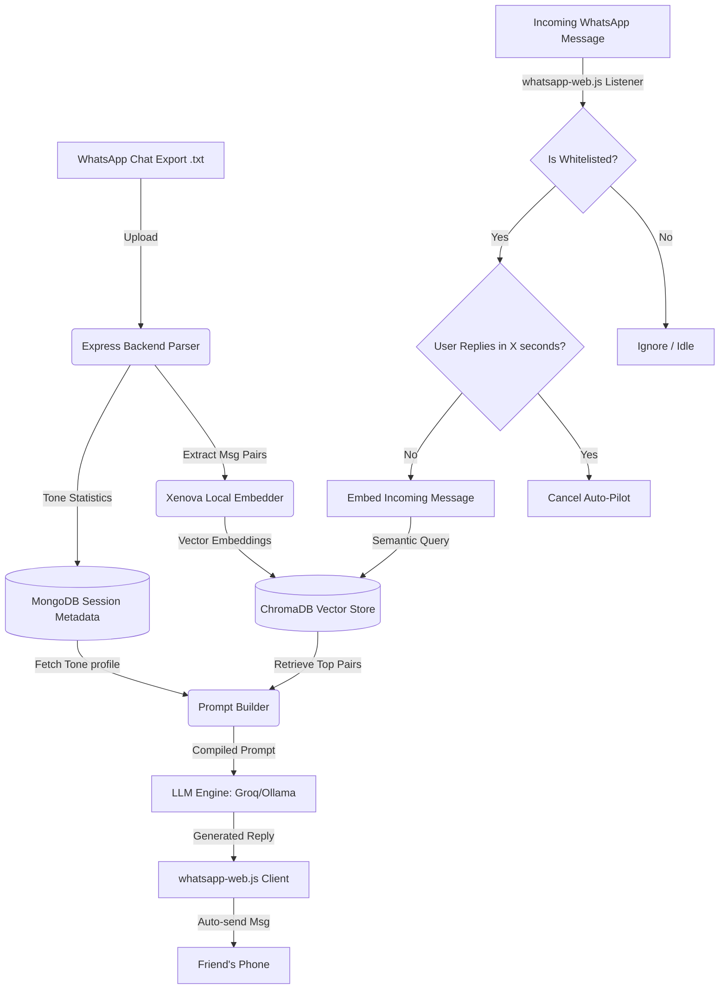

<div align="center">

<br />


# Signet

**Your Personal AI Clone. Written in your hand.**

Upload a chat export — Signet learns exactly how you talk. It analyzes your tone,
phrase length, vocabulary, and emoji habits to create an authentic replica of your
texting style.

<p align="center">
  <a href="https://signet-web.vercel.app"></a>
  <a href="#mobile"></a>
  <a href="https://signet-web.vercel.app/docs"></a>
</p>

<p align="center">
  
  
  
  
  
  
  
</p>

<br />

---

<br />

</div>

## Overview

**Never leave a friend on read.** Modern communication is constant and overwhelming. When driving, attending meetings, sleeping, or working, we often leave people hanging, leading to missed opportunities or social friction. Traditional autoreply bots are robotic, rigid, and impersonal — they kill conversational flow instantly.

Signet is a **full-stack AI cloning platform** built for [HackSprint 2k26](https://hacksprint-2k26.vercel.app/). Feed it a WhatsApp chat export (or any messaging history), and it builds a **vector embedding** of your communication style. The result? An AI clone that talks, thinks, and responds exactly like you.

You can then chat with your AI clone, tune its creativity, explore public personas,
and dive into conversation analytics — all wrapped in a glassmorphism-designed UI.

### Why Signet?

| Problem | Signet's Solution |
|---------|------------------|
| Autoreply bots sound robotic | **RAG-powered tone cloning** — learns your exact vocabulary, emoji habits, and sentence rhythm |
| Generic AI doesn't know you | **Semantic few-shot injection** — retrieves your most similar past messages as context |
| Setup is too complex | **One-click upload** — export your WhatsApp chat and you're done |
| Privacy matters | **Local-first architecture** — ChromaDB + Ollama support for fully offline operation |

The project spans **three platforms**:

| Platform | Stack | Location |
|----------|-------|----------|
| **Web App** | React 19, Vite 8, Tailwind v4 | [`web/`](web/) |
| **Mobile App** | Expo 54, React Native 0.81, Redux | [`mobile/`](mobile/) |
| **Backend API** | Express, MongoDB, ChromaDB, Ollama / OpenAI | [`backend/`](backend/) |

## Features

### Core AI

| Feature | Description |
|---------|-------------|
| **Chat Upload & Parsing** | Upload `.txt` WhatsApp exports; the regex-based parser intelligently extracts conversation pairs with timestamps, contact names, emoji counts, word counts, and message threading — even handling group chats and media messages |
| **RAG-Powered AI Clone** | Retrieval-augmented generation combines ChromaDB vector similarity search with your computed tone profile to produce replies that authentically sound like you — not a generic chatbot |
| **Algorithmic Tone Profiling** | Quantitative analysis of your messaging style: average reply length, emoji frequency, capitalization ratio (formal vs. casual), punctuation habits (ellipses, exclamation marks), and common slang patterns |
| **Persona Library** | Chat with predefined personas (Steve Jobs, Naruto, Einstein, Sherlock Holmes, and more) or explore community-created clones — each with curated tone profiles |
| **Continuous Learning** | Every chat with your clone adds new message pairs back into ChromaDB, making it smarter and more accurate over time — it literally learns from every interaction |
| **Temperature Control** | Tune the creativity slider from precise/factual (low temp ~0.3) to wild/creative (high temp ~1.5) — find your perfect balance |
| **Deep Analytics** | View rich statistics on your conversation patterns: message length distribution, emoji usage frequency, average response time, peak activity hours, and vocabulary richness |
| **WhatsApp Auto-Pilot** | Real-time WhatsApp Web client integration via `whatsapp-web.js` — whitelist contacts, set auto-reply timeouts, and let your clone handle responses when you're busy |

### Platform-Specific

| Platform | Highlights | Details |
|----------|-----------|---------|
| **Web** | Glassmorphism UI · Light/dark theme · Responsive design · Interactive demo | `web/` — React 19 SPA with Vite 8, Zustand state management, React Router v7, and a polished glassmorphism design system |
| **Mobile** | Native Expo app · Bottom-tab navigation · Offline mode · Biometric auth | `mobile/` — React Native 0.81 with Expo 54, Redux Persist for offline state, React Navigation 7, FlashList for smooth scrolling |
| **Backend** | RESTful API · JWT auth · Rate limiting · Helmet headers · Graceful fallbacks | `backend/` — Express 4 server with in-memory MongoDB fallback for dev, multi-provider LLM support (Ollama, OpenAI, Groq), ChromaDB vector store |

### Security & Privacy

| Measure | Implementation |
|---------|---------------|
| **HTTP Security** | Helmet middleware sets secure headers (CSP, X-Frame-Options, HSTS, etc.) |
| **Password Hashing** | bcrypt with 12 salt rounds — industry-standard password storage |
| **Authentication** | JWT-based with configurable expiry, refresh support |
| **Rate Limiting** | Dedicated rate limiters on `/upload` and `/chat` endpoints to prevent abuse |
| **Session Expiry** | TTL-based auto-cleanup — inactive sessions are automatically purged |
| **Data Retention** | Chat data is never stored permanently — automatically wiped after session expiry |
| **Local-First Option** | Run fully offline with Ollama + local ChromaDB — zero data leaves your machine |

## Tech Stack

### Backend (`backend/`)

| Category | Technology | Purpose |
|----------|-----------|---------|
| **Runtime** | Node.js 24, Express 4 | HTTP server & API routing |
| **Primary Database** | MongoDB 7 with Mongoose 9 | User accounts, sessions, personas, chat metadata |
| **Vector Database** | ChromaDB 1.9 | 384-dimensional embedding storage & similarity search |
| **Embeddings** | HuggingFace `Xenova/all-MiniLM-L6-v2` (ONNX) | Local embedding generation via Transformers.js |
| **Authentication** | JWT + bcryptjs | Token-based auth with 12-round salted hashing |
| **LLM Providers** | Ollama (local), OpenAI API, Groq (Llama-3.3-70b) | Multi-provider LLM abstraction layer |
| **File Upload** | Multer + Sharp | Multipart file parsing & image processing |
| **WhatsApp** | whatsapp-web.js + Puppeteer | WebSocket-based WhatsApp Web automation |
| **Testing** | Vitest + Supertest + mongodb-memory-server | Unit, integration, and benchmark testing |
| **Infrastructure** | Docker Compose | Orchestrates ChromaDB + MongoDB + Ollama containers |
| **Package Manager** | pnpm (workspace) | Fast, disk-efficient monorepo management |

### Web Frontend (`web/`)

| Category | Technology | Purpose |
|----------|-----------|---------|
| **Framework** | React 19 + Vite 8 | Modern SPA with lightning-fast HMR |
| **Styling** | Tailwind CSS v4 + Glassmorphism tokens | Utility-first CSS with custom design system |
| **State Management** | Zustand 5 | Lightweight, hook-based reactive state |
| **Routing** | React Router v7 | Client-side routing with lazy-loaded pages |
| **HTTP Client** | Axios 1 | Promise-based HTTP with interceptors |
| **UI Components** | Lucide React, react-dropzone, react-hot-toast, QR code | Icon library, file drag-drop, toast notifications, QR generation |
| **Linting** | Oxlint 1 | Rust-based blazing-fast linting |
| **Deployment** | Netlify | SPA deployment with SPA redirect rules |

### Mobile (`mobile/`)

| Category | Technology | Purpose |
|----------|-----------|---------|
| **Framework** | Expo 54 + React Native 0.81 | Cross-platform native mobile runtime |
| **Navigation** | React Navigation 7 (native stack + bottom tabs) | Type-safe screen transitions |
| **State Management** | Redux Toolkit + Redux Persist | Predictable state with offline persistence |
| **HTTP Client** | Axios 1 | Shared API client with web frontend pattern |
| **UI Enhancements** | Expo Blur, Linear Gradient, FlashList | Glassmorphism effects, gradients, high-perf lists |
| **Build & Deploy** | EAS Build (dev/preview/production) | Cloud-based iOS & Android builds |
| **Language** | TypeScript 5.9 | Full type safety across the codebase |

## Architecture

```
┌─────────────────────────────────────────────────────┐
│                    Web (Vite)                        │
│   React 19 · Tailwind · Zustand · React Router      │
│   └─→ api/client.ts ←── VITE_API_BASE_URL           │
└──────────────────────┬──────────────────────────────┘
                       │ HTTPS / REST
┌──────────────────────▼──────────────────────────────┐
│              Backend API (Express)                   │
│   ┌──────────┐  ┌──────────┐  ┌──────────────────┐  │
│   │  Routes   │  │  Brain   │  │  LLM Providers   │  │
│   │  /upload  │  │  Embedder│  │  Ollama          │  │
│   │  /chat    │  │  Retriever│ │  OpenAI          │  │
│   │  /auth    │  │  Reranker│  │  Groq            │  │
│   │  /session │  │  Prompts │  │                  │  │
│   │  /persona │  │  Personas│  └──────────────────┘  │
│   │  /whatsapp│  └────┬─────┘                         │
│   └──────────┘         │                              │
│        ┌───────────────┼──────────────┐               │
│   ┌────▼─────┐  ┌──────▼──────┐  ┌───▼───────┐      │
│   │  MongoDB  │  │  ChromaDB   │  │  Memory   │      │
│   │ (Mongoose)│  │ (Vectors)   │  │  Cache    │      │
│   └──────────┘  └─────────────┘  └───────────┘      │
│        ┌──────────────────────────────────┐          │
│        │  WhatsApp Web Client             │          │
│        │  (whatsapp-web.js + Puppeteer)   │          │
│        └──────────────────────────────────┘          │
└──────────────────────┬──────────────────────────────┘
                       │ HTTPS / REST
┌──────────────────────▼──────────────────────────────┐
│              Mobile (Expo)                           │
│   React Native · Redux · React Navigation           │
│   └─→ api/client.ts ←── EXPO_PUBLIC_API_URL         │
└─────────────────────────────────────────────────────┘
```

### Mermaid Diagram



### Data Flow

1. **Upload** → User uploads a WhatsApp `.txt` export → parser extracts conversation pairs (incoming + reply) → each pair is embedded via HuggingFace Transformers → vectors stored in ChromaDB → tone profile computed → session created in MongoDB.
2. **Chat** → User sends message → retriever queries ChromaDB for similar conversation pairs → RAG pipeline builds a system prompt + user prompt with retrieved examples → LLM generates a reply in the user's style → new pair is added back to the vector store (continuous learning).
3. **Personas** → Predefined persona pairs (Steve Jobs, Naruto, Einstein, etc.) are seeded at startup → users can browse, bookmark, and chat with them just like their own clones.
4. **WhatsApp Live** → WhatsApp Web client connects via QR code → real-time message ingestion → continuous learning from live conversations.

## Getting Started

### Prerequisites

| Requirement | Version | Notes |
|-------------|---------|-------|
| **Node.js** | >= 22 | Required for all runtime environments |
| **pnpm** | Latest | Recommended package manager (npm also works) |
| **Docker** | Latest | Required for local ChromaDB + MongoDB + Ollama |
| **Git** | Latest | For version control |

### 1. Clone & Install

```bash
git clone https://github.com/your-org/pixelpwnz.git
cd pixelpwnz

# Install all dependencies (uses pnpm workspaces)
pnpm install

# Or install individually with npm:
# cd backend && npm install && cd ..
# cd web && npm install && cd ..
# cd mobile && npm install && cd ..
```

> **Troubleshooting**: If you encounter `ERR_PNPM_NO_PACKAGE_MANIFEST`, ensure you're in the project root. If native dependencies fail (Sharp, Puppeteer), make sure your system has build tools installed (`build-essential` on Linux, Xcode CLI on macOS).

### 2. Start Infrastructure

```bash
cd backend
docker compose up -d
```

This spins up three services:

| Service | Port | Purpose |
|---------|------|---------|
| **ChromaDB** | `8000` | Vector embedding storage & similarity search |
| **MongoDB** | `27017` | Primary data store (users, sessions, personas) |
| **Ollama** | `11434` | Local LLM inference (optional — falls back to Groq) |

To verify everything is running:
```bash
docker compose ps
```

### 3. Configure Environment

```bash
# Backend — defaults work with Docker, but copy and tweak as needed
cp backend/.env.example backend/.env

# Web — point to your local backend
cp web/.env.example web/.env
# Edit web/.env: VITE_API_BASE_URL=http://localhost:5000/api

# Mobile — point to your backend
# Set EXPO_PUBLIC_API_URL in your shell or .env
```

**Key environment variables to customize:**

| Variable | Default | Description |
|----------|---------|-------------|
| `JWT_SECRET` | *(auto-generated)* | Secret key for JWT token signing |
| `MONGODB_URI` | `mongodb://localhost:27017/signet` | MongoDB connection string |
| `CHROMA_URL` | `http://localhost:8000` | ChromaDB server URL |
| `LLM_PROVIDER` | `groq` | LLM provider: `ollama`, `openai`, or `groq` |
| `GROQ_API_KEY` | — | Required if using Groq as LLM provider |
| `OPENAI_API_KEY` | — | Required if using OpenAI as LLM provider |

### 4. Seed Personas (optional)

Populate the database with predefined personas (Steve Jobs, Einstein, Naruto, etc.):

```bash
cd backend
node upload-personas.js
```

You should see output confirming each persona was uploaded. Run this **once** after initial setup.

### 5. Run the Application

You'll need **three terminal windows** to run all services simultaneously:

```bash
# Terminal 1: Backend API (http://localhost:5000)
cd backend && npm run dev

# Terminal 2: Web app (http://localhost:5173)
cd web && npm run dev

# Terminal 3: Mobile (Expo Go / simulator)
cd mobile && npm start
```

**Verify it's working:**
- Backend health check: `curl http://localhost:5000/api/health` → `{ "status": "ok" }`
- Web app: Open `http://localhost:5173` in your browser
- Mobile: Scan the Expo QR code with Expo Go on your phone

## Project Structure

```
pixelpwnz/
├── backend/                        # Express API server
│   ├── src/
│   │   ├── brain/                  # AI core
│   │   │   ├── chromaClient.js     # ChromaDB vector store client
│   │   │   ├── embedder.js         # HuggingFace embedding pipeline
│   │   │   ├── index.js            # Brain module orchestrator
│   │   │   ├── personas.js         # Persona definitions & seed data
│   │   │   ├── promptBuilder.js    # RAG prompt construction
│   │   │   ├── reranker.js         # Result re-ranking logic
│   │   │   ├── retriever.js        # Vector similarity search
│   │   │   └── PROMPTS.md          # Prompt engineering docs
│   │   ├── llm/
│   │   │   └── provider.js         # LLM abstraction (Ollama, OpenAI, Groq)
│   │   ├── middleware/
│   │   │   ├── auth.js             # JWT authentication
│   │   │   ├── errorHandler.js     # Global error handling
│   │   │   └── upload.js           # Multer file upload config
│   │   ├── models/
│   │   │   ├── ChatMessage.js      # Chat message schema
│   │   │   ├── Persona.js          # Persona schema
│   │   │   └── User.js             # User account schema
│   │   ├── parser/
│   │   │   ├── index.js            # WhatsApp chat parser
│   │   │   └── regex.js            # Regex patterns for chat parsing
│   │   ├── routes/
│   │   │   ├── auth.js             # Register, login, profile
│   │   │   ├── chat.js             # Chat with clone
│   │   │   ├── config.js           # Public config endpoint
│   │   │   ├── persona.js          # Persona CRUD & bookmarks
│   │   │   ├── session.js          # Session CRUD
│   │   │   ├── sessions.js         # List user sessions
│   │   │   ├── stats.js            # Conversation analytics
│   │   │   ├── upload.js           # Chat file upload
│   │   │   └── whatsapp.js         # WhatsApp integration routes
│   │   ├── store/
│   │   │   ├── Session.js          # Session model
│   │   │   └── sessionStore.js     # In-memory + MongoDB session store
│   │   ├── whatsapp/
│   │   │   └── client.js           # WhatsApp Web client (whatsapp-web.js)
│   │   ├── config.js               # Environment configuration
│   │   ├── db.js                   # MongoDB connection (with in-memory fallback)
│   │   └── index.js                # Express app entry point
│   ├── tests/
│   │   ├── fixtures/               # Test chat exports
│   │   │   ├── simple-chat.txt
│   │   │   ├── group-chat.txt
│   │   │   └── media-heavy.txt
│   │   ├── auth.integration.test.js
│   │   ├── chat.integration.test.js
│   │   ├── latency.test.js
│   │   ├── parser.test.js
│   │   ├── promptBuilder.test.js
│   │   ├── retriever.test.js
│   │   ├── sessions.integration.test.js
│   │   └── upload.integration.test.js
│   ├── docker-compose.yml          # ChromaDB + MongoDB + Ollama
│   ├── upload-personas.js          # Persona seed script
│   ├── vitest.config.js            # Test configuration
│   ├── pnpm-workspace.yaml         # pnpm workspace config
│   └── .env.example                # Environment variables template
│
├── web/                            # React web application
│   ├── src/
│   │   ├── api/
│   │   │   └── client.js           # Axios HTTP client
│   │   ├── components/
│   │   │   ├── ui/                 # Primitive UI components
│   │   │   │   ├── card.jsx
│   │   │   │   └── skeleton.jsx
│   │   │   ├── DashboardLayout.jsx
│   │   │   ├── DeleteModal.jsx
│   │   │   ├── Footer.jsx
│   │   │   ├── InsightsModal.jsx
│   │   │   ├── InteractiveDotGrid.jsx
│   │   │   ├── MessageBubble.jsx
│   │   │   ├── MessageList.jsx
│   │   │   ├── Navbar.jsx
│   │   │   ├── PremiumLoader.jsx
│   │   │   ├── PrivacyModal.jsx
│   │   │   ├── ProtectedRoute.jsx
│   │   │   ├── StatsPanel.jsx
│   │   │   ├── ThemeToggle.jsx
│   │   │   └── ToastProvider.jsx
│   │   ├── pages/
│   │   │   ├── app-dashboard/      # Dashboard sub-pages
│   │   │   │   ├── BookmarksPage.jsx
│   │   │   │   ├── NewDashboardPage.jsx
│   │   │   │   ├── NewProfilePage.jsx
│   │   │   │   ├── NotificationsPage.jsx
│   │   │   │   └── WhatsAppPage.jsx
│   │   │   ├── ChatPage.jsx
│   │   │   ├── CreateNewPage.jsx
│   │   │   ├── DashboardPage.jsx
│   │   │   ├── DemoPage.jsx
│   │   │   ├── DocsPage.jsx
│   │   │   ├── ExplorePage.jsx
│   │   │   ├── LandingPage.jsx
│   │   │   ├── LoginPage.jsx
│   │   │   ├── NotFoundPage.jsx
│   │   │   ├── ProfilePage.jsx
│   │   │   ├── SecurityPage.jsx
│   │   │   └── UploadPage.jsx
│   │   ├── sections/               # Landing page sections
│   │   │   ├── AboutSection.jsx
│   │   │   ├── CtaSection.jsx
│   │   │   ├── DemoSection.jsx
│   │   │   ├── DocsSection.jsx
│   │   │   ├── FaqSection.jsx
│   │   │   ├── FeaturesPreviewSection.jsx
│   │   │   ├── HeroSection.jsx
│   │   │   ├── HowItWorksSection.jsx
│   │   │   ├── PrivacySection.jsx
│   │   │   ├── SecuritySection.jsx
│   │   │   └── TrustedSection.jsx
│   │   ├── store/
│   │   │   ├── authStore.js        # Auth state (Zustand)
│   │   │   ├── chatStore.js        # Chat state (Zustand)
│   │   │   └── uiStore.js          # UI/theme state (Zustand)
│   │   ├── assets/                 # Static assets
│   │   │   ├── hero.png
│   │   │   ├── react.svg
│   │   │   └── vite.svg
│   │   ├── App.jsx                 # Root component with router
│   │   ├── main.jsx                # Vite entry point
│   │   └── index.css               # Global styles + design tokens
│   ├── public/                     # Public assets
│   │   ├── favicon.png
│   │   ├── favicon.svg
│   │   ├── icons.svg
│   │   └── logo.png
│   ├── .oxlintrc.json              # Oxlint configuration
│   ├── index.html
│   ├── vite.config.js
│   ├── netlify.toml                # Netlify deployment config
│   └── .env.example
│
├── mobile/                         # React Native / Expo app
│   ├── api/
│   │   └── client.ts               # Axios HTTP client
│   ├── components/
│   │   ├── StatsHeader.tsx
│   │   └── ThinkingDots.tsx
│   ├── constants/
│   │   └── theme.ts                # Design tokens (colors, typography, spacing)
│   ├── navigation/
│   │   ├── AppNavigator.tsx        # Root navigator
│   │   ├── AuthNavigator.tsx       # Auth flow navigator
│   │   └── MainTabNavigator.tsx    # Bottom tab navigator
│   ├── screens/
│   │   ├── BookmarksScreen.tsx
│   │   ├── ChatScreen.tsx
│   │   ├── DiscoverScreen.tsx
│   │   ├── HomeScreen.tsx
│   │   ├── LandingScreen.tsx
│   │   ├── LoginScreen.tsx
│   │   ├── PrivacyModal.tsx
│   │   ├── ProfileScreen.tsx
│   │   ├── RegisterScreen.tsx
│   │   └── UploadScreen.tsx
│   ├── store/
│   │   ├── authSlice.ts            # Auth state (Redux)
│   │   ├── bookmarksSlice.ts       # Bookmarks state (Redux)
│   │   ├── chatSlice.ts            # Chat state (Redux)
│   │   ├── sessionSlice.ts         # Session state (Redux)
│   │   ├── hooks.ts                # Typed Redux hooks
│   │   └── index.ts                # Redux store configuration
│   ├── assets/                     # App icons & splash screen
│   │   ├── icon.png
│   │   ├── splash-icon.png
│   │   ├── favicon.png
│   │   ├── android-icon-background.png
│   │   ├── android-icon-foreground.png
│   │   └── android-icon-monochrome.png
│   ├── App.tsx                     # Root component
│   ├── index.ts                    # Expo entry point
│   ├── app.config.js               # Expo configuration
│   ├── eas.json                    # EAS Build profiles
│   ├── babel.config.js
│   ├── tsconfig.json
│   └── .env.example
│
├── render.yaml                     # Render.com deployment manifest
├── package-lock.json               # Root lockfile
└── README.md                       # This file
```

## API

The backend exposes a RESTful API at `/api`. All endpoints return JSON responses. Authenticated endpoints require a `Bearer <token>` header.

### Authentication

#### `POST /api/auth/register`
Create a new user account.

```json
// Request
{ "name": "Alex", "email": "alex@example.com", "password": "secure123" }
// Response 201
{ "success": true, "token": "eyJhbG...", "user": { "id": "...", "name": "Alex", "email": "alex@example.com" } }
```

#### `POST /api/auth/login`
Log in with existing credentials.

```json
// Request
{ "email": "alex@example.com", "password": "secure123" }
// Response 200
{ "success": true, "token": "eyJhbG...", "user": { "id": "...", "name": "Alex", "email": "alex@example.com" } }
```

#### `GET /api/auth/me` *(Auth required)*
Get the currently authenticated user's profile.

```json
// Response 200
{ "success": true, "user": { "id": "...", "name": "Alex", "email": "alex@example.com", "createdAt": "2026-07-11T..." } }
```

### Sessions & Chat

#### `POST /api/upload` *(Auth required)*
Upload a WhatsApp chat export (`.txt` file, multipart form-data).

| Field | Type | Description |
|-------|------|-------------|
| `file` | File | WhatsApp `.txt` export |
| `contactName` | string | Name of the contact for pair extraction |

```json
// Response 201
{ "success": true, "sessionId": "...", "pairsExtracted": 142, "toneProfile": { "avgLength": 8.3, "emojiFreq": 0.42, "capsRatio": 0.65 } }
```

#### `POST /api/chat` *(Auth required)*
Send a message to your AI clone.

```json
// Request
{ "sessionId": "...", "message": "What do you think about the new design?" }
// Response 200
{ "success": true, "reply": "honestly? it's clean but the nav feels a bit crowded, maybe collapse the sidebar?", "sources": 3 }
```

#### `GET /api/session/:id` *(Auth required)*
Get session details including tone profile and message history.

#### `DELETE /api/session/:id` *(Auth required)*
Delete a session and its associated vector embeddings.

```json
// Response 200
{ "success": true, "message": "Session deleted" }
```

#### `GET /api/sessions` *(Auth required)*
List all sessions for the authenticated user.

```json
// Response 200
{ "success": true, "sessions": [{ "id": "...", "contactName": "Mom", "messageCount": 89, "createdAt": "..." }] }
```

#### `GET /api/stats/:id` *(Auth required)*
Get detailed analytics for a session.

```json
// Response 200
{ "success": true, "stats": { "totalMessages": 142, "avgResponseTime": "2.4s", "emojiUsage": 42, "topWords": ["lol", "yeah", "okay"], "lengthDistribution": { "1-5": 23, "6-10": 45, "11-20": 38, "20+": 14 } } }
```

### Personas

#### `GET /api/persona/bookmarks` *(Auth required)*
Get the current user's bookmarked personas.

#### `POST /api/persona/:id/bookmark` *(Auth required)*
Toggle a bookmark on a persona (add or remove).

```json
// Response 200
{ "success": true, "bookmarked": true, "personaId": "..." }
```

### System

#### `GET /api/config`
Get public configuration (LLM provider, features, etc.).

```json
// Response 200
{ "llmProvider": "groq", "maxUploadSize": "10MB", "features": { "whatsapp": true, "analytics": true } }
```

#### `GET /api/health`
Health check endpoint.

```json
// Response 200
{ "status": "ok", "uptime": 123456, "version": "1.0.0" }
```

### Quick Reference

| Method | Endpoint | Auth | Purpose |
|--------|----------|------|---------|
| `POST` | `/api/auth/register` | No | Create account |
| `POST` | `/api/auth/login` | No | Sign in |
| `GET` | `/api/auth/me` | Yes | Current user |
| `POST` | `/api/upload` | Yes | Upload chat export |
| `POST` | `/api/chat` | Yes | Chat with clone |
| `GET` | `/api/session/:id` | Yes | Session details |
| `DELETE` | `/api/session/:id` | Yes | Delete session |
| `GET` | `/api/sessions` | Yes | List sessions |
| `GET` | `/api/stats/:id` | Yes | Session analytics |
| `GET` | `/api/persona/bookmarks` | Yes | Bookmarked personas |
| `POST` | `/api/persona/:id/bookmark` | Yes | Toggle bookmark |
| `GET` | `/api/config` | No | Public config |
| `GET` | `/api/health` | No | Health check |

See the [full API documentation](https://signet-web.vercel.app/docs) for detailed request/response schemas.

## Deployment

### Backend (Render)

The backend is deployed via `render.yaml` which defines two services:

| Service | Type | Description |
|---------|------|-------------|
| **signet-backend** | Node.js Web Service | Express API with JWT auth, ChromaDB integration, and LLM routing |
| **signet-chromadb** | Docker Service | ChromaDB vector store for production embedding queries |

**Key production environment variables:**

| Variable | Description |
|----------|-------------|
| `NODE_ENV=production` | Enables production middleware (compression, CORS hardening) |
| `JWT_SECRET` | Strong random secret for token signing |
| `MONGODB_URI` | Production MongoDB Atlas connection string |
| `CHROMA_URL` | Production ChromaDB service URL |
| `LLM_PROVIDER` | `groq` or `openai` (not Ollama in production) |
| `CORS_ORIGIN` | Frontend domain for CORS whitelist |
| `RATE_LIMIT_WINDOW` | Rate limit time window in ms |
| `RATE_LIMIT_MAX` | Max requests per window |

### Frontend (Netlify)

The web frontend is configured for Netlify deployment via `web/netlify.toml`:

```toml
[build]
  command = "npm run build"
  publish = "dist"

[[redirects]]
  from = "/*"
  to = "/index.html"
  status = 200
```

**Deployment steps:**
1. Push the `web/` directory to a Netlify-linked Git repository
2. Set `VITE_API_BASE_URL` to your production backend URL (e.g., `https://signet-api.onrender.com/api`)
3. Deploy — Netlify automatically runs `npm run build` and serves the `dist/` folder
4. All routes fall through to `index.html` for the React Router SPA

### Mobile (EAS)

The mobile app uses Expo EAS Build with three profiles in `mobile/eas.json`:

| Profile | Command | Use Case |
|---------|---------|----------|
| **development** | `eas build --profile development` | Internal dev client with Expo Go-like debugging |
| **preview** | `eas build --profile preview` | TestFlight / Internal testing track |
| **production** | `eas build --profile production` | App Store / Google Play submission |

```bash
# Build for production
cd mobile
eas build --platform all --profile production
```

## Testing

### Backend Tests (Vitest)

```bash
cd backend

# Run the full test suite
npm test

# Watch mode — re-runs on file changes
npm run test:watch

# Run benchmarks (response time measurements)
npm run test:bench

# Run a specific test file
npx vitest run tests/parser.test.js
```

### Test Suites

| Suite | File | Coverage | Fixtures Used |
|-------|------|----------|---------------|
| **Auth** | `tests/auth.integration.test.js` | Register, login, token validation, duplicate emails, invalid credentials | — |
| **Chat** | `tests/chat.integration.test.js` | Message flow, RAG pipeline, session context, temperature effects | `simple-chat.txt` |
| **Upload** | `tests/upload.integration.test.js` | File parsing, ingestion pipeline, tone profile computation | `simple-chat.txt`, `group-chat.txt`, `media-heavy.txt` |
| **Sessions** | `tests/sessions.integration.test.js` | CRUD operations, TTL expiry, edge cases | — |
| **Retriever** | `tests/retriever.test.js` | Vector search relevance, result ranking, similarity thresholds | `simple-chat.txt` |
| **Parser** | `tests/parser.test.js` | WhatsApp format parsing, group chats, media messages, edge cases | `simple-chat.txt`, `group-chat.txt`, `media-heavy.txt` |
| **Prompt Builder** | `tests/promptBuilder.test.js` | Prompt construction, system message assembly, few-shot formatting | — |
| **Latency** | `tests/latency.test.js` | Response time benchmarks, p50/p95/p99 metrics | — |

### Test Fixtures

Located in `backend/tests/fixtures/`:

| Fixture | Description |
|---------|-------------|
| `simple-chat.txt` | Standard 1-on-1 WhatsApp conversation (~50 messages) |
| `group-chat.txt` | Group chat with multiple participants (~120 messages) |
| `media-heavy.txt` | Chat with images, videos, and voice notes included |

### Web Linting

```bash
cd web

# Run Oxlint (Rust-based linter, extremely fast)
npm run lint

# Check specific rules
npx oxlint --deny-warnings
```

### CI Pipeline

Tests run automatically on push via the CI pipeline. The pipeline:
1. Installs dependencies with `pnpm install`
2. Starts ChromaDB + MongoDB via Docker
3. Runs all Vitest test suites
4. Runs Oxlint on the web frontend
5. Reports results and coverage

## Built With

### Frontend & Mobile
| Library | Version | Purpose |
|---------|---------|---------|
| [React](https://react.dev/) | 19.2 | UI framework |
| [Vite](https://vite.dev/) | 8.1 | Build tool & dev server |
| [Tailwind CSS](https://tailwindcss.com/) | 4.3 | Utility-first CSS |
| [Zustand](https://zustand.docs.pmnd.rs/) | 5.0 | Lightweight state management |
| [React Router](https://reactrouter.com/) | 7.18 | Client-side routing |
| [Expo](https://expo.dev/) | 54 | React Native framework |
| [React Native](https://reactnative.dev/) | 0.81 | Mobile runtime |
| [Redux Toolkit](https://redux-toolkit.js.org/) | 2.12 | Predictable state container |
| [React Navigation](https://reactnavigation.org/) | 7 | Mobile navigation |

### Backend & AI
| Library | Version | Purpose |
|---------|---------|---------|
| [Express](https://expressjs.com/) | 4.19 | HTTP server framework |
| [MongoDB](https://www.mongodb.com/) | 7 | Document database |
| [Mongoose](https://mongoosejs.com/) | 9 | MongoDB ODM |
| [ChromaDB](https://www.trychroma.com/) | 1.9 | Vector database |
| [HuggingFace Transformers](https://huggingface.co/docs/transformers/) | — | Local embedding generation |
| [Ollama](https://ollama.ai/) | — | Local LLM inference |
| [OpenAI](https://openai.com/) | — | Cloud LLM provider |
| [Groq](https://groq.com/) | — | Fast inference LLM provider |

### WhatsApp & Automation
| Library | Purpose |
|---------|---------|
| [whatsapp-web.js](https://wwebjs.dev/) | WhatsApp Web client automation |
| [Puppeteer](https://pptr.dev/) | Headless browser control |
| [QR Code Terminal](https://github.com/gtanner/qrcode-terminal) | QR display for WhatsApp auth |


---

<div align="center">

<br />

**Built for [HackSprint 2k26](https://hackathon.url)** &nbsp;·&nbsp; Made by [PixelPwnz](https://github.com/pixelpwnz)

</div>
