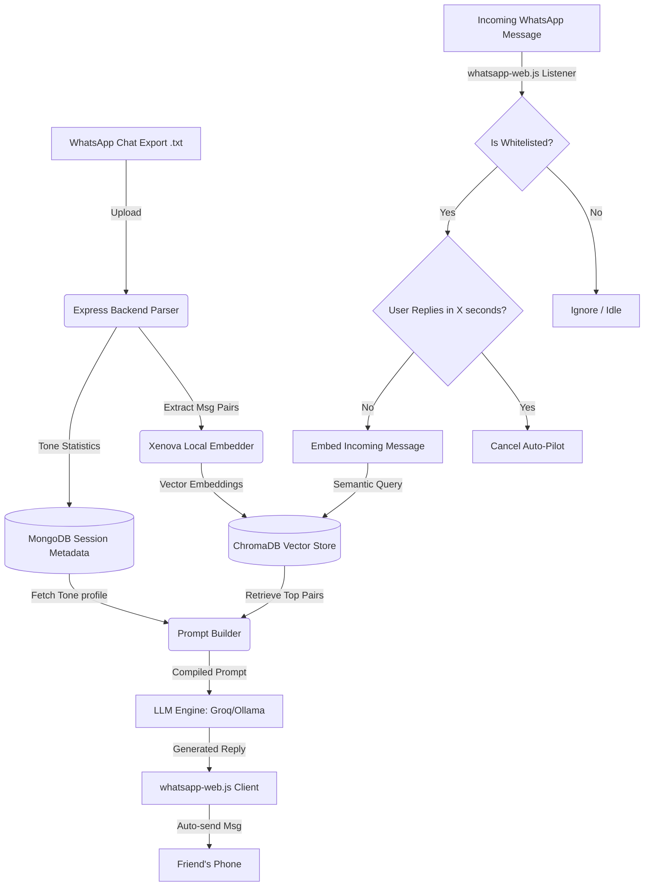

# 🌌 Signet — Your Personal AI Clone Proxy

> **HackSprint 2k26 Hackathon Project**
> 
> Never leave a friend on read. Extract your unique tone, vocabulary, and personality from chat exports to build a secure personal AI proxy that responds on WhatsApp on your behalf.

---

## 📋 Table of Contents
1. [Problem Statement](#-problem-statement)
2. [Our Approach](#-our-approach)
3. [Algorithmic Tone Profiling](#-algorithmic-tone-profiling)
4. [RAG vector Pipeline](#-rag-vector-pipeline)
5. [Architecture & Data Flow](#-architecture--data-flow)
6. [Mermaid Diagram](#-mermaid-diagram)
7. [Tech Stack](#-tech-stack)
8. [Codebase Directory Structure](#-codebase-directory-structure)
9. [Super Detailed API Documentation](#-super-detailed-api-documentation)
10. [WhatsApp Integration (Auto-Pilot)](#-whatsapp-integration-auto-pilot)
11. [Mobile App Overview (Expo 54)](#-mobile-app-overview-expo-54)
12. [Setup & Installation](#-setup--installation)
13. [Deployment Guidelines](#-deployment-guidelines)
14. [Dev Team & Contributions](#-dev-team--contributions)

---

## 🔍 Problem Statement
Modern communication is constant and overwhelming. When driving, attending meetings, sleeping, or working, we often leave people "on read," leading to missed opportunities or social friction. Traditional autoreply bots are robotic, rigid, and impersonal, which immediately kills conversational flow. 

**Signet** bridges this gap by extracting your personal conversational patterns to build an AI clone that talks, thinks, and responds exactly like you.

---

## 💡 Our Approach
Rather than relying on generic system instructions, Signet implements a specialized **RAG (Retrieval-Augmented Generation)** strategy:
1. **Dynamic Tone Profiling**: Analyzes chat logs to extract emoji frequency, capitalization behaviors, punctuation habits, average sentence lengths, and common slang.
2. **Semantic Few-Shot Injecting**: When an incoming message is received, we query a vector database for the top 3-5 most similar historical messages you sent. These are injected into the prompt as direct contextual examples.
3. **Local Embedding Generation**: Offloads embedding generation locally on the server using `Xenova/all-MiniLM-L6-v2` for low-latency similarity queries.

---

## 🧮 Algorithmic Tone Profiling
To clone a human personality, the system performs a quantitative analysis on the parsed message-reply pairs. The metrics extracted include:

* **Average Reply Length**: Calculated as the sum of words in all user replies divided by the total number of conversation pairs:
  $$\text{AvgLength} = \frac{\sum_{i=1}^{N} \text{WordCount}(\text{Reply}_i)}{N}$$
* **Emoji Frequency**: The ratio of user replies containing at least one emoji to the total number of replies:
  $$\text{EmojiFreq} = \frac{\sum_{i=1}^{N} [\text{Reply}_i \text{ contains emoji}]}{N}$$
* **Capitalization Ratio**: Evaluates how often the user starts their sentences with a capital letter. A ratio $< 0.4$ indicates a casual lowercase typing style, while $> 0.7$ indicates a formal style.
* **Punctuation Profiles**: Tracks the presence of ellipses (`...`), multiple exclamation marks (`!!`), and trailing question marks (`?`) in replies.

---

## 🗄️ RAG Vector Pipeline
When a chat `.txt` file is uploaded:
1. **Chunking & Parsing**: Messages are parsed into logical blocks based on timezone-specific timestamp headers.
2. **Batch Embedding**: The backend runs the `Xenova/all-MiniLM-L6-v2` model in a single-threaded WASM pipeline to generate 384-dimensional vector embeddings for all incoming messages.
3. **ChromaDB Storage**: Pairs are saved as documents where:
   - **Document Body**: The User's reply.
   - **Embedding Vector**: The vector generated from the Friend's incoming message.
   - **Metadata**: Stores the context (`session_id`, `contact_name`, `timestamp`, `emoji_count`, etc.) to support exact filtering.

---

## ⚙️ Architecture & Data Flow

```
[ Incoming Message on WhatsApp ]
                │
                ▼
      [ Suffix Validation ] ───► (Drop if Group Chat)
                │
                ▼
   [ Whitelist Contact Filter ] ──► (Drop if not selected in Dashboard)
                │
                ▼
     [ Wait-Time Timeout ] ───► (Starts countdown; cancels if user replies manually)
                │
                ▼ (Timer Expires)
   [ ChromaDB Vector Search ] ──► (Finds top 3-5 similar message-reply pairs)
                │
                ▼
     [ Prompt Compilation ] ───► (Tone profile + semantic history + new message)
                │
                ▼
      [ LLM Generation ] ──────► (Groq / Ollama generation in user's tone)
                │
                ▼
[ Reply Sent back via WhatsApp ]
```

---

## 📊 Mermaid Diagram



---

## 🛠️ Tech Stack
* **Frontend**: React (Vite), Vanilla CSS, Tailwind CSS utilities (where requested), Lucide Icons, Axios.
* **Backend**: Node.js, Express.js.
* **Vector DB**: ChromaDB.
* **Database**: MongoDB (Atlas).
* **WhatsApp Orchestration**: Puppeteer, `whatsapp-web.js` (LocalAuth).
* **LLM Engine**: Groq (Llama-3.3-70b-versatile) / Ollama.
* **Mobile Client**: React Native, Expo 54.

---

## 📂 Codebase Directory Structure

```
pixelpwnz-HackSprint/
├── backend/
│   ├── src/
│   │   ├── brain/            # Embedding, ChromaDB queries, and prompt compilation
│   │   │   ├── chromaClient.js
│   │   │   ├── embedder.js
│   │   │   ├── promptBuilder.js
│   │   │   └── retriever.js
│   │   ├── db/               # MongoDB configuration and connection
│   │   ├── llm/              # Ollama and Groq API adapters
│   │   │   └── provider.js
│   │   ├── middleware/       # JWT Auth and file upload parser configurations
│   │   ├── models/           # Mongoose schemas (User, Session, ChatMessage)
│   │   ├── parser/           # Regex-based WhatsApp chat text parser
│   │   ├── routes/           # Express API endpoints
│   │   └── whatsapp/         # Puppeteer-based whatsapp-web.js handlers
│   │       └── client.js
│   └── package.json
└── web/
    ├── src/
    │   ├── api/              # Axios instance and API abstraction
    │   ├── components/       # Reusable layout and UI elements (DashboardLayout, etc.)
    │   ├── pages/            # Core pages (ChatPage, ExplorePage, UploadPage)
    │   │   └── app-dashboard/# Sub-pages (NewDashboardPage, WhatsAppPage, NewProfilePage)
    │   ├── store/            # Zustand state management (authStore, uiStore)
    │   └── App.jsx
    └── package.json
```

---

## 🔌 Super Detailed API Documentation

### 🔐 Authentication

#### `POST /api/auth/register`
Creates a new user profile.
* **Request Body**:
  ```json
  {
    "name": "Rishab",
    "email": "rishab@example.com",
    "password": "securepassword123"
  }
  ```
* **Response (201 Created)**:
  ```json
  {
    "success": true,
    "token": "eyJhbGciOiJIUzI1NiIsInR5cCI6IkpXVCJ9...",
    "user": {
      "id": "6a510098833b36ef32ee2251",
      "name": "Rishab",
      "email": "rishab@example.com"
    }
  }
  ```

#### `POST /api/auth/login`
Logs in an existing user.
* **Request Body**:
  ```json
  {
    "email": "rishab@example.com",
    "password": "securepassword123"
  }
  ```
* **Response (200 OK)**:
  ```json
  {
    "success": true,
    "token": "eyJhbGciOiJIUzI1NiIsInR5cCI6IkpXVCJ9...",
    "user": {
      "id": "6a510098833b36ef32ee2251",
      "name": "Rishab",
      "email": "rishab@example.com"
    }
  }
  ```

---

### 🧠 Brain Sessions

#### `GET /api/sessions`
Fetches the active custom brains for the logged-in user.
* **Headers**: `Authorization: Bearer <token>`
* **Response (200 OK)**:
  ```json
  {
    "success": true,
    "sessions": [
      {
        "session_id": "9b1deb4d-3b7d-4bad-9bdd-2b0d7b3dcb6d",
        "contact_name": "Vineet / Rishab",
        "created_at": "2026-07-11T05:32:00.000Z",
        "pair_count": 3175,
        "isCustom": true
      }
    ]
  }
  ```

#### `POST /api/upload`
Uploads a `.txt` WhatsApp conversation log to extract a persona.
* **Headers**: `Authorization: Bearer <token>`
* **Content-Type**: `multipart/form-data`
* **Multipart Fields**:
  - `chatFile`: (The raw `.txt` file)
  - `user_name`: "Rishab"
* **Response (200 OK)**:
  ```json
  {
    "success": true,
    "session_id": "9b1deb4d-3b7d-4bad-9bdd-2b0d7b3dcb6d",
    "user_name": "Rishab",
    "contact_name": "Vineet / Rishab",
    "total_pairs_extracted": 3175,
    "estimated_generation_time_ms": 11112
  }
  ```

---

### 🟢 WhatsApp Auto-Pilot

#### `GET /api/whatsapp/status`
Checks the current connection state of the user's headless WhatsApp client.
* **Headers**: `Authorization: Bearer <token>`
* **Response (200 OK)**:
  ```json
  {
    "success": true,
    "status": "connected",
    "autoPilotConfig": {
      "enabled": true,
      "sessionId": "9b1deb4d-3b7d-4bad-9bdd-2b0d7b3dcb6d",
      "waitTimeMs": 30000,
      "allowedChats": ["919876543210@c.us", "60924580876363@lid"]
    }
  }
  ```

#### `POST /api/whatsapp/toggle`
Saves your Auto-Pilot preferences (timeout, target brain, allowed contact list).
* **Headers**: `Authorization: Bearer <token>`
* **Request Body**:
  ```json
  {
    "enabled": true,
    "sessionId": "9b1deb4d-3b7d-4bad-9bdd-2b0d7b3dcb6d",
    "waitTimeMs": 10000,
    "allowedChats": ["919876543210@c.us"]
  }
  ```
* **Response (200 OK)**:
  ```json
  {
    "success": true,
    "autoPilotConfig": {
      "enabled": true,
      "sessionId": "9b1deb4d-3b7d-4bad-9bdd-2b0d7b3dcb6d",
      "waitTimeMs": 10000,
      "allowedChats": ["919876543210@c.us"]
    }
  }
  ```

---

## 📱 Mobile App Overview (Expo 54)
Designed by **Daksh**, the mobile client is built on **Expo 54** to give users a native dashboard experience on Android and iOS:
* **Real-time Configuration**: Instantly syncs with the Express backend to toggle the Auto-Pilot engine or move the wait-time slider from your phone.
* **Live Notifications**: Receives system push notifications when the Auto-Pilot replies to a contact on WhatsApp, showing you the transcript of what your AI clone sent.
* **File Upload Integration**: Accesses the native mobile file system to pick and upload chat exports (`.txt` files) directly to the server.

---

## 🚀 Setup & Installation

### Prereqs
* Node.js v18+
* MongoDB database
* Local ChromaDB instance

### Setup
1. Clone the repository:
   ```bash
   git clone https://github.com/rishab11250/pixelpwnz-HackSprint.git
   cd pixelpwnz-HackSprint
   ```
2. Configure `.env` in the `backend/` directory:
   ```env
   PORT=5000
   MONGODB_URI=mongodb+srv://...
   CHROMA_URL=http://localhost:8000
   GROQ_API_KEY=gsk_...
   ```
3. Install dependencies and start developers servers:
   ```bash
   # Backend
   cd backend
   pnpm install
   pnpm run dev

   # Frontend
   cd ../web
   pnpm install
   pnpm run dev
   ```

---

## ☁️ Deployment Guidelines

### Running on a VPS (AWS EC2 / DigitalOcean)
To ensure the Puppeteer client runs smoothly on Ubuntu:
1. Install Chromium system libraries:
   ```bash
   sudo apt-get update
   sudo apt-get install -y gconf-service libasound2 libatk1.0-0 libc6 libcairo2 libcups2 libdbus-1-3 libexpat1 libfontconfig1 libgcc1 libgconf-2-4 libgdk-pixbuf2.0-0 libglib2.0-0 libgtk-3-0 libnspr4 libpango-1.0-0 libpangocairo-1.0-0 libstdc++6 libx11-6 libx11-xcb1 libxcb1 libxcomposite1 libxcursor1 libxdamage1 libxext6 libxfixes3 libxi6 libxrandr2 libxrender1 libxss1 libxtst6 ca-certificates fonts-liberation libappindicator1 libnss3 lsb-release xdg-utils wget
   ```
2. Set Environment Variables:
   ```bash
   PUPPETEER_SKIP_CHROMIUM_DOWNLOAD=true
   PUPPETEER_EXECUTABLE_PATH=/usr/bin/google-chrome-stable
   ```

---

## 👥 Dev Team & Contributions

| Member | Role & Ownership | GitHub |
| :--- | :--- | :--- |
| **Rishab** | Prompt Engineering, WhatsApp integration & Vector DB | [@rishab11250](https://github.com/rishab11250) |
| **Ronit** | Web App — Full Design & UI/UX Frontend | [@RonitkumarSoni](https://github.com/RonitkumarSoni) |
| **Daksh** | Mobile App Development (Expo 54) | [@daksh006v](https://github.com/daksh006v) |
| **Vineet** | Backend Routing & LLM Orchestration | [@vineet1cg](https://github.com/vineet1cg) |